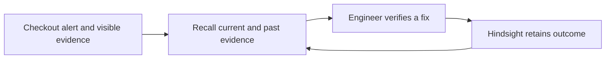

# Recall — six-slide outline

## 1. The problem

**Message:** Teams repeat incident investigation because the useful outcome of a past outage is hard to retrieve under pressure.

**Visual:** Alert → manual search through old notes → delayed decision.

## 2. Recall

**Message:** Recall saves engineer-confirmed causes, failed attempts, successful fixes, and verification in Hindsight.

**Visual:** The customer checkout, live evidence, and agent recommendation.

## 3. The memory loop

## 4. Demonstrated evidence

| Scenario | Demonstrated behavior |
| --- | --- |
| First connection leak | Current-log analysis with no history |
| Repeated connection leak | Retrieved the prior failed restart and confirmed fix |
| Payment outage with the same HTTP 503 | Rejected the old database fix because the database was healthy |

Use a screenshot of the completed scorecard.

## 5. Why it is safer than plain retrieval

**Message:** A past incident is a lead, not a command.

**Visual:** The **Past lesson does not apply** comparison card.

## 6. Scope and next step

**Message:** The prototype validates the memory loop in a controlled environment. The next test is approved, sanitized postmortems.

Do not claim recovery-time reductions or production integration without measured evidence.
